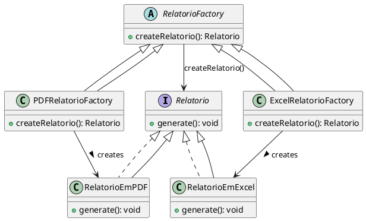
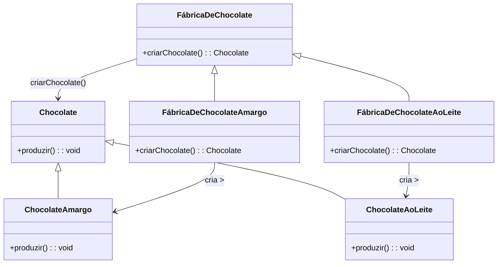

# Factory Method

## Árlei Nóbrega Oliveira (20221TADSSAJ0012)

[@Arlei10](https://github.com/Arlei10)

<!-- @include: ../../../includes/seminario-1-Arlei10/README.md -->

## José Victor Oliveira dos Santos (20212TADSSAJ0008)

[@zevictoros](https://github.com/zevictoros)

<!-- @include: ../../../includes/seminario-1-zevictoros/README.md -->

## WALLACE SELES NEVES

## Leandro

@[code](../../../includes/Leandro/factory_method/Recepcionista.java)

## João Augusto

<figure>

## Guilherme Sampaio

</figure>
